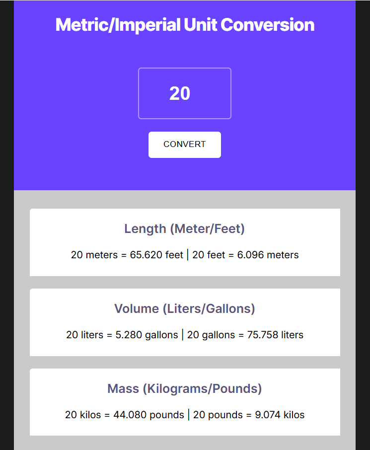

# Project: Unit Converter

## Description
This project was created as part of the *Frontend Developer Career Path* on Scrimba.  
It is a simple metric/imperial unit converter where the user inputs a number and gets conversions for **length (meters/feet)**, **volume (liters/gallons)**, and **mass (kilograms/pounds)**.  
The goal is to practice DOM manipulation, basic input validation, and clean JavaScript structures.

---

## Features
- Single input value converted across three categories at once:
  - Length: meters ⇄ feet
  - Volume: liters ⇄ gallons
  - Mass: kilograms ⇄ pounds
- Two alternative JS implementations:
  1) **Nested objects** holding factors  
  2) **Array of objects** + `find()` helper function
- Basic validation for empty/negative inputs
- Responsive, accessible layout with a clear visual hierarchy

---

## Technologies Used
- HTML5
- CSS3 (layout, hover effects)
- JavaScript (DOM APIs, events, arrays/objects, `toFixed`)

---

## Project Structure
project-unit-converter/
├── index.html # version using nested objects + index.js
├── index.js
├── index1.html # version using an array of objects + index1.js
├── index1.js
├── index.css
└── media/
└── preview.png # screenshot for the README

---

## Screenshot

---

## How It Works (high-level)
- Reads the numeric value from the input field
- Validates the value and stops on invalid input
- Computes conversions using fixed factors
- Updates three result lines for length, volume, and mass using `textContent/innerHTML`

---

## What I Learned
- Organizing conversion factors in nested objects vs an array of objects
- Using `Array.prototype.find()` to look up the correct conversion factor
- Handling click events and updating the DOM efficiently
- Formatting numbers with `Number(...).toFixed(3)`
- Keeping HTML/CSS/JS separated and readable

---

## Demo
GitHub Pages: https://caterinada.github.io/project-unit-converter/

---

## Author
Caterina De Ambrosis  
Frontend Developer Student – Aulab & Scrimba  
GitHub: https://github.com/CaterinaDA
